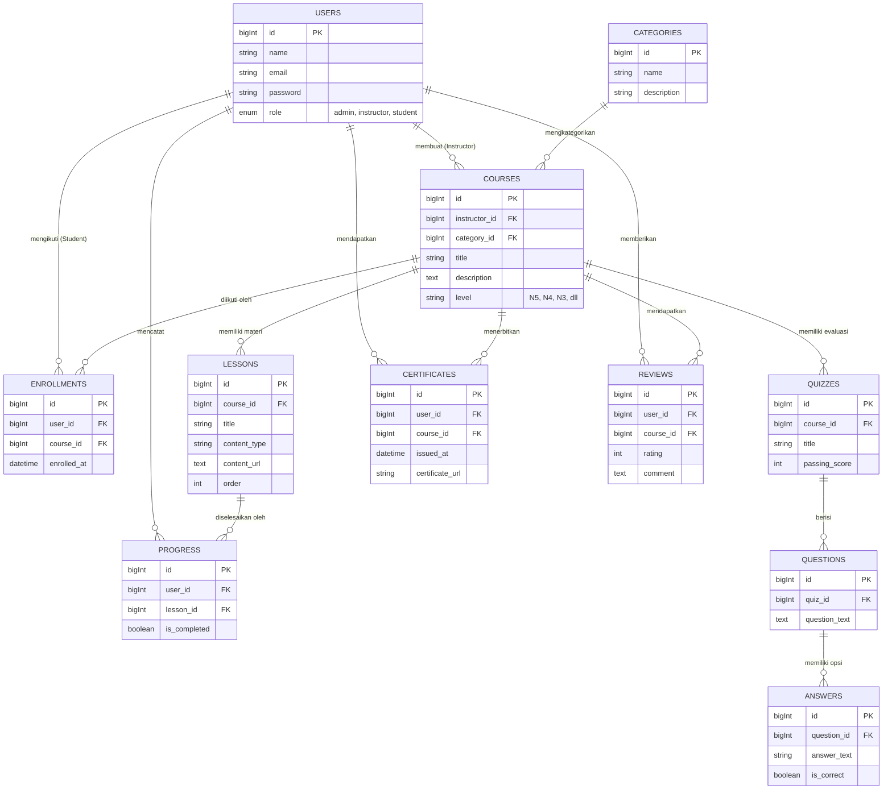

# Product Requirements Document (PRD)
## Aplikasi Platform E-Learning Bahasa Jepang

**Disusun Oleh:** Senior Product Manager & Tech Lead
**Tanggal:** 6 Juli 2026

---

## 1. Ringkasan Eksekutif (Executive Summary)
Aplikasi Platform E-Learning Bahasa Jepang adalah sistem manajemen pembelajaran (LMS) berbasis web yang dirancang untuk memfasilitasi pelajar dari tingkat pemula (JLPT N5) hingga mahir (JLPT N1) dalam mempelajari tata bahasa, kosakata, kanji, serta kemampuan mendengar (choukai) dan membaca (dokkai). Aplikasi ini bertujuan untuk memberikan pengalaman belajar yang terstruktur, interaktif, dan mudah diukur progresnya.

---

## 2. Tujuan Produk (Product Goals)
1. **Meningkatkan Aksesibilitas:** Menyediakan materi pembelajaran bahasa Jepang yang komprehensif yang dapat diakses kapan saja dan di mana saja.
2. **Evaluasi Terukur:** Memberikan fitur ujian/kuis mirip format standar JLPT (Japanese-Language Proficiency Test) secara real-time.
3. **Keterlibatan Pengguna (Engagement):** Mendorong motivasi belajar melalui sistem pelacakan progres belajar dan skor kuis.

---

## 3. Fitur Utama (Core Features)

### 3.1. Manajemen Pengguna & Hak Akses
*   **Siswa (Student):** Dapat mendaftar, mengikuti kursus, menonton/membaca materi (lesson), dan mengerjakan kuis.
*   **Instruktur (Instructor):** Dapat membuat kursus, mengunggah materi pelajaran, membuat soal kuis, dan memantau kemajuan siswa.
*   **Admin/Superadmin:** Mengelola seluruh data platform, mengelola *users*, sistem *settings*, dan memoderasi kursus.

### 3.2. Manajemen Pembelajaran (LMS)
*   **Katalog Kursus:** Pengelompokan berdasarkan level JLPT (N5, N4, N3, N2, N1) atau kategori keahlian (Kanji, Grammar, Listening, Reading).
*   **Materi Belajar (Lessons):** Mendukung multimedia (Video, Audio untuk *Choukai*, Gambar/PDF untuk *Kanji/Dokkai*, dan Teks).
*   **Sistem Kuis & Evaluasi:** Pertanyaan pilihan ganda berbasis JLPT beserta pembahasan jawaban.
*   **Pelacakan Progres (Progress Tracking):** Indikator persentase penyelesaian sebuah kursus yang diambil siswa.

---

## 4. Skema Data & Arsitektur

### 4.1. Penjelasan Naratif
Untuk mendukung fitur-fitur di atas, arsitektur basis data relasional dirancang menggunakan entitas inti berikut:

1.  **Users**: Tabel sentral untuk semua pengguna, mencakup `id`, `name`, `email`, `password`, dan `role` (Admin, Instructor, Student).
2.  **Courses**: Tabel yang menyimpan data kursus, seperti `title`, `description`, `level` (misal: N5, N4), `instructor_id` (relasi ke Users), dan `status` (Draft, Published).
3.  **Lessons**: Berisi modul atau materi spesifik di dalam sebuah kursus (`course_id`), dengan `title`, `content_type` (video, teks, dokumen), `content_url`, dan `order` (urutan materi).
4.  **Enrollments**: Tabel perantara (*pivot*) yang mencatat kapan seorang siswa (`user_id`) mendaftar/mengikuti sebuah kursus (`course_id`), beserta tanggal `enrolled_at`.
5.  **Progress**: Mencatat riwayat materi pelajaran yang telah diselesaikan oleh siswa. Menyimpan relasi `user_id`, `lesson_id`, dan penanda `is_completed`.
6.  **Quizzes**: Menyimpan data evaluasi yang terikat dengan sebuah kursus (`course_id`), meliputi `title` dan `passing_score`.
7.  **Questions**: Tabel yang menyimpan soal-soal kuis (`quiz_id`).
8.  **Answers**: Tabel yang menyimpan opsi jawaban untuk soal (`question_id`) yang mencakup status `is_correct`.
9.  **Categories**: Menyimpan data kategori atau label untuk mengelompokkan kursus (misalnya: JLPT N5, N4, Kanji).
10. **Certificates**: Menyimpan data sertifikat yang diterbitkan untuk siswa setelah berhasil menyelesaikan sebuah kursus.
11. **Reviews**: Menyimpan ulasan dan penilaian (rating) yang diberikan oleh siswa terhadap suatu kursus.

### 4.2. Visualisasi ERD (Entity-Relationship Diagram)

---

## 5. Tumpukan Teknologi (Tech Stack)
*   **Backend:** PHP (Laravel Framework)
*   **Frontend:** Blade Templating dengan Bootstrap (NiceAdmin Dashboard Template), terintegrasi dengan Vite.
*   **Database:** SQLite / MySQL / PostgreSQL.
*   **Version Control:** Git (GitHub/GitLab).

## 6. Penutup
Dokumen PRD ini menjadi acuan utama (Single Source of Truth) bagi tim Developer, QA, dan Stakeholder dalam membangun MVP (Minimum Viable Product) Aplikasi Platform E-Learning Bahasa Jepang. Perubahan dan iterasi fitur di masa depan akan dicatat dalam revisi PRD ini.
